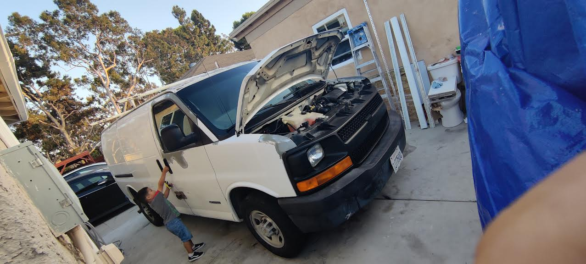

# 🚗 Vehicle Repair Gallery

Welcome to the master index of hands-on vehicle repairs. Each entry documents a real-world job, complete with diagnostic notes, tools used, images, and results.

---

## 🔧 1. [Prius Head Gasket Replacement](./prius_head_gasket_log.md)
**Vehicle:** 2015 Toyota Prius (3rd Gen Hybrid)  
**Scope:** Full head gasket failure diagnosis, disassembly, and replacement.  
**Outcome:** Engine restored to working order after intensive teardown.

---

## 🌡️ 2. [Prius Coolant System Troubleshooting](./prius_coolant_test.md)  
**Vehicle:** 2015 Toyota Prius  
**Scope:** Investigated overheating issues and potential coolant blockage.  
**Outcome:** Identified no coolant flow; confirmed HG failure.  

---

## 🔌 3. [Chevrolet Van Engine + Trailer Wiring Repair](./chevrolet_van_engine_repair.md)  
**Vehicle:** Chevrolet Express Van  
**Scope:** Replaced misfiring components (knock sensor, plugs), plus full trailer wiring job.  
**Outcome:** Restored performance, installed tow harness.

---

## 🔋 4. [Honda Civic Hybrid Battery & Cooling Fix](./honda_civic_hybrid_repair.md)  
**Vehicle:** 2006 Honda Civic Hybrid  
**Scope:** Used Prolong system for hybrid battery reconditioning. Also fixed cooling fan and thermostat.  
**Outcome:** Sold post-fix for full value. Avoided junkyard loss.

---

## 🧊 5. [Honda Civic Cooling & Fan Fix (Thermostat + Fan Motor)](./honda_civic_hybrid_repair.md#coolant-fan-troubleshooting--fix)  
**Vehicle:** 2006 Honda Civic Hybrid  
**Scope:** Diagnosed stuck thermostat and non-functional fan motor.  
**Outcome:** Replaced both; engine cooling fully restored.  

---

## 🧰 6. [Coworker Crash Repair Assistance (Acura TSX)](./coworker_crash_repair_assist.md)  
**Vehicle:** Acura TSX  
**Scope:** Guided coworker through radiator and front-end rebuild after crash.  
**Outcome:** Saved $2,000+ and taught hands-on repair.  

---

## 📂 Directory Map

All related photos are stored in:

---

## ✅ Status: Live Documentation Project  
More entries to be added as projects continue. Each file includes full breakdowns, diagnostic logic, and cost-saving insights.
